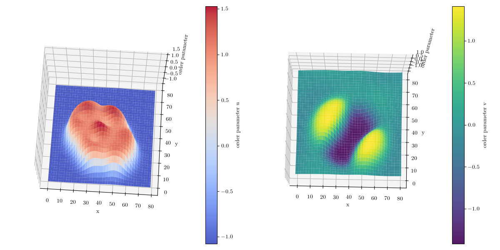

# cahn-hilliard-2D-spectral
Spectral solution of coupled Cahn-Hilliard equations in multiple dimensions.

The dynamics of the state of the two mixed systems under consideration, $u$ and $v$ evolves to minimize the value of
an energy functional in the following expression: 


$$
F_{\epsilon_u, \epsilon_v ,\sigma }(u,v) = \int_{\Omega} \left( \frac{\epsilon_u^2}{2} |\nabla u|^2 + \frac{\epsilon_v^2}{2} |\nabla v|^2 + W(u,v) + \frac{\sigma}{2} \left| (-\Delta)^{-1/2} (v - \overline{v}) \right|^2 \right) \, dr  \tag{1}
$$


where

$$
W\left( u,v\right) =\frac{\left( u^{2}-1\right) ^{2}}{4}+\frac{\left(
v^{2}-1\right) ^{2}}{4}+b_1 uv-b_{2}\frac{uv^{2}}{2}   \tag{2}
$$


The associated Euler-Lagrange system of equations corresponding to the mixed
system  are two coupled  CH equations, as follows:

$$
\tau_u u_t = -\Delta \left( \epsilon_u^2 \Delta u + (1-u)(1+u)u - b_1 v + \frac{b_2}{2} v^2 \right)  \tag{3}
$$

and

$$
\tau_v v_t = -\Delta \big( \epsilon_v^2 \Delta v + (1-v)(1+v)v - b_1 u + b_2 uv \big) - \sigma (v - \overline{v})   \tag{4}
$$

The provided code uses a semi-implicit discretization to compute the solution of Eqs. (3) and (4). It also computes the free energy in Eq. (1), displaying the separate terms in the expression in the same plot. Additionally, it plots the integrand in Eq. (1) to show the energy excess at the interfaces of the particle.




## References
For further reading, you can refer to the following article:

```bibtex
@Article{Avalos2016,
  author    = {Avalos, Edgar and Higuchi, Takeshi and Teramoto, Takashi and Yabu, Hiroshi and Nishiura, Yasumasa},
  title     = {Frustrated phases under three-dimensional confinement simulated by a set of coupled Cahn-Hilliard equations},
  journal   = {Soft Matter},
  year      = {2016},
  volume    = {12},
  pages     = {5905-5914},
  doi       = {10.1039/C6SM00429F},
  issue     = {27},
  publisher = {The Royal Society of Chemistry},
  url       = {http://dx.doi.org/10.1039/C6SM00429F},
}


